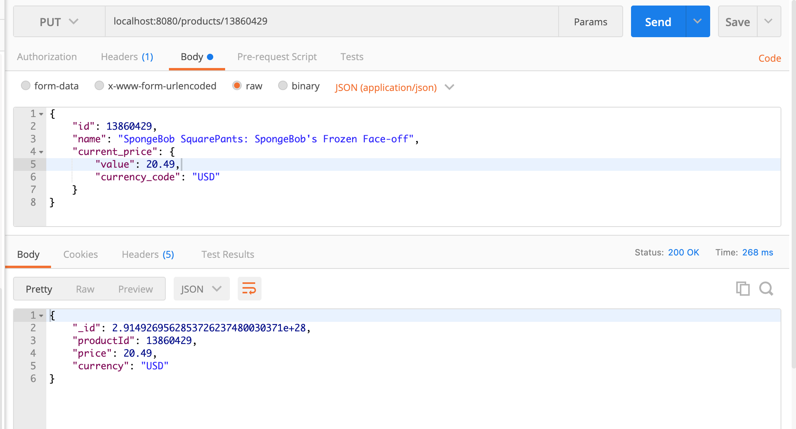
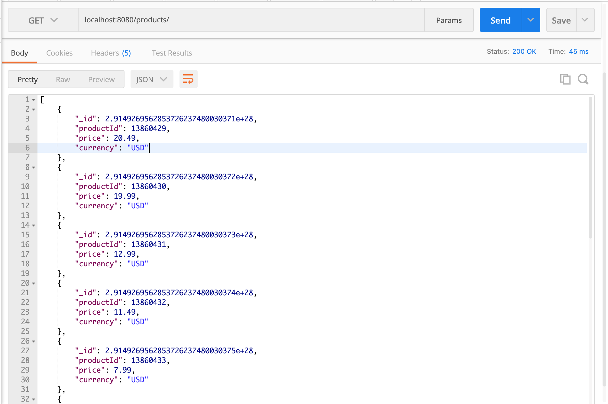
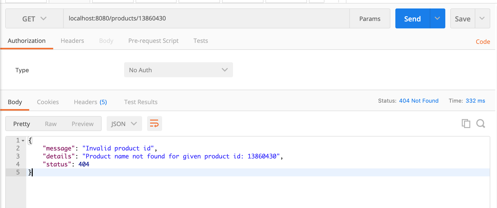
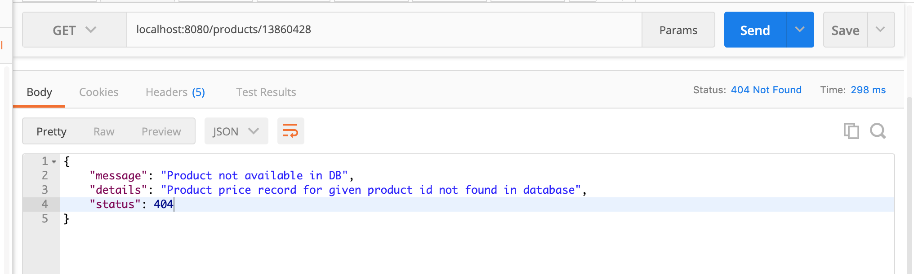
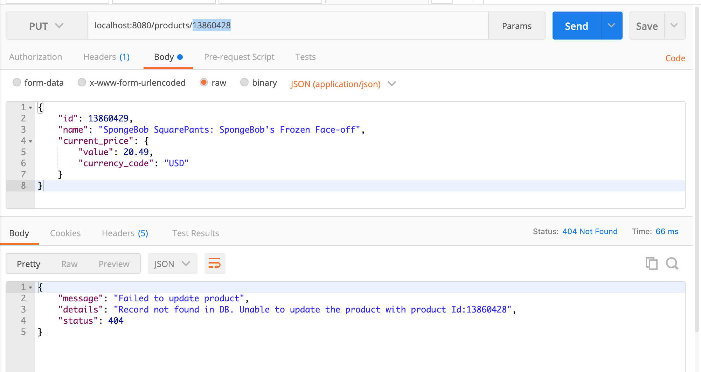
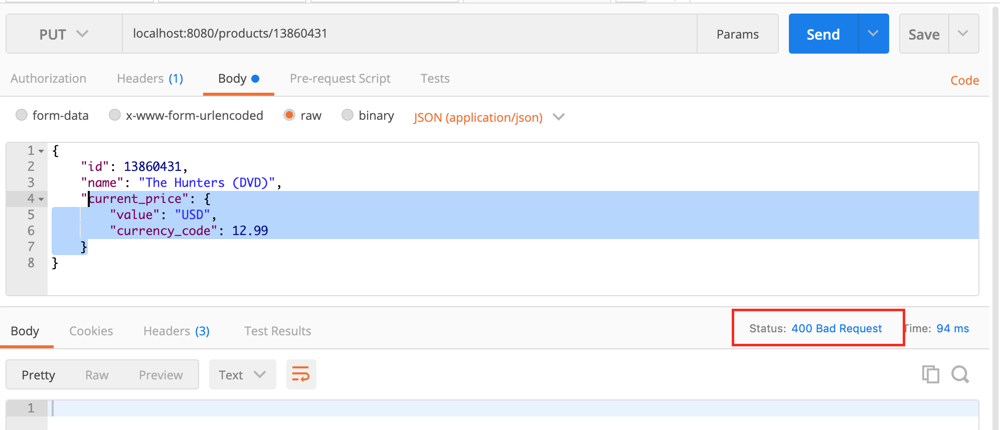

# Target - MyRetail RESTful Service - Case Study

Myretail application is designed to get the product information such as productId, product name and product price details for the given product id and also to update the product price or currency code for the given productId to save it to the database.

Business Logic : This application is responsible for retrieving product details such as product name from the source(external API) and product price details from Mongo database for the given productId.

Source: http://redsky.target.com/v2/pdp/tcin/13860428?excludes=taxonomy,price,promotion,bulk_ship,rating_and_review_reviews,rating_and_review_statistics,question_answer_statistics
	
## Technologies
Tools and Technologies used :
* Java 8
* Spring Boot
* Maven
* Mongo DB
* Mockito / Junit
* Postman

## Setup

1. Install MongoDB on your local machine and start the Mongo server.
- MongoDB connection configurations for this project are given as below: (all the configurations are mentioned in application.properties file)
  ```
  Host : localhost
  Mongo port : 27017
  Database : myretail
  Collection : product
  ```
2. Check out the code from GitHub by downloading the project as zip file or clone it using eclipse.
- Application can be run either from IDE(Eclipse) or from the command line.
  - If using IDE, run the MyRetailApplication.java file where main method of the application resides.
  - If command line, using maven exceute `mvn spring-boot:run` command.
  - Server will start on `port 8080` 
  
### API Documentation
Below mentioned are the end points in this application.

```
Method      Request EndPoint       Input             		 Description
GET         /products/{id}        ProductId			 To get product details for the given productId
PUT         /products/{id}        ProductId, ProductInfo         To update the product price for the given productId
```

#### GET Request with productId
 ```http://localhost:8080/products/{id}```
  - To get the product details for the given productId.
 
 
 ```http://localhost:8080/products/13860429```
 
 ```
Output:
 {
    "id": 13860429,
    "name": "SpongeBob SquarePants: SpongeBob's Frozen Face-off",
    "current_price": {
        "value": 8.49,
        "currency_code": "USD"
    }
}
Response: 200 OK
```


#### PUT Request with productId
 ```http://localhost:8080/products/{id}```
 - To update the product price or currency code for the given productId.
 
  ```http://localhost:8080/products/13860429```
 - Updating the product price from 8.49USD to 20.49USD for the productId-13860429
  
  ```
Input:
  {
    "id": 13860429,
    "name": "SpongeBob SquarePants: SpongeBob's Frozen Face-off",
    "current_price": {
        "value": 20.49,
        "currency_code": "USD"
    }
}
Output:
{
    "_id": 2.9149269562853726237480030371e+28,
    "productId": 13860429,
    "price": 20.49,
    "currency": "USD"
}
  Response : 200 OK
```



#### GET Request
 ```http://localhost:8080/products/```
 - To get all the products infromation from the database.




#### Exception Handling Scenarios
1. ProductNotFoundException: Failed to get product details for the given productId which exists in the database but not in the source(external API)


```localhost:8080/products/13860430```

```	
Output:
{
    "message": "Invalid product id",
    "details": "Product name not found for given product id: 13860430",
    "status": 404
}
Response: 404 Not Found
```




2. ProductPriceNotFoundInDBException: Failed to get product details for the given productId which does not exist in the database but exists in the source(external API)

```localhost:8080/products/13860428```

```
Output:
{
    "message": "Product not available in DB",
    "details": "Product price record for given product id not found in database",
    "status": 404
}
Response: 404 Not Found
```



3. FailedToUpdateProductException: Failed to update product details for the given productId which does not exist in the database.

```localhost:8080/products/13860428```

```
Input:
{
    "id": 13860429,
    "name": "SpongeBob SquarePants: SpongeBob's Frozen Face-off",
    "current_price": {
        "value": 20.49,
        "currency_code": "USD"
    }
}
Output:
{
    "message": "Failed to update product",
    "details": "Record not found in DB. Unable to update the product with product Id:13860428",
    "status": 404
}
Response: 404 Not Found
```



4. Failed to update product details for the given productId with invalid payload.

```localhost:8080/products/13860431```

```
Input:
{
    "id": 13860431,
    "name": "The Hunters (DVD)",
    "current_price": {
        "value": "USD",
        "currency_code": 12.99
    }
}
Output:
Response: 400 Bad Request
```



