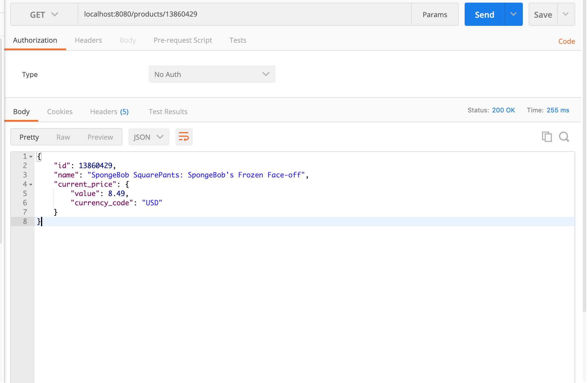

# Target - MyRetail RESTful Service - Case Study

myRetail is a rapidly growing company with HQ in Richmond, VA and over 200 stores across the east coast. myRetail wants to make its internal data available to any number of client devices, from myRetail.com to native mobile apps.

The goal for this exercise is to create an end-to-end Proof-of-Concept for a products API, which will aggregate product data from multiple sources and return it as JSON to the caller. Your goal is to create a RESTful service that can retrieve product and price details by ID. The URL structure is up to you to define, but try to follow some sort of logical convention. Build an application that performs the following actions: Responds to an HTTP GET request at /products/{id} and delivers product data as JSON (where {id} will be a number.

Example product IDs: 15117729, 16483589, 16696652, 16752456, 15643793) Example response: {"id":13860428,"name":"The Big Lebowski (Blu-ray) (Widescreen)","current_price":{"value": 13.49,"currency_code":"USD"}}

Performs an HTTP GET to retrieve the product name from an external API. (For this exercise the data will come from redsky.target.com, but let’s just pretend this is an internal resource hosted by myRetail)

Example: http://redsky.target.com/v2/pdp/tcin/13860428?excludes=taxonomy,price,promotion,bulk_ship,rating_and_review_reviews,rating_and_review_statistics,question_answer_statistics

Reads pricing information from a NoSQL data store and combines it with the product id and name from the HTTP request into a single response.

BONUS: Accepts an HTTP PUT request at the same path (/products/{id}), containing a JSON request body similar to the GET response, and updates the product’s price in the data store.

# Solution

Myretail application is designed to get the product information such as productId, product name and product price details for the given product id and also to update the product price for the given productId to save it in the database.

Business Logic : This application is responsible for retrieving product details such as product name from the source(external API) and product price details from the NoSQL database based on the productId.

Source: http://redsky.target.com/v2/pdp/tcin/13860428?excludes=taxonomy,price,promotion,bulk_ship,rating_and_review_reviews,rating_and_review_statistics,question_answer_statistics
	
## Technologies
Technology Stack of this project include the following :
* Java 8
* Spring Boot
* Maven
* Mongo DB
* Mockito / Junit
* Postman

## Setup

1. Install MongoDB on your local machine and start the Mongo server.
- MongoDB connection configurations for this project are given as below: (all the configurations are mentioned in application.properties file)
  ```
  Host : localhost
  port : 27017
  Database : myretail
  Collection : products
  ```
2. Check out the code from GitHub by downloading the project as zip file or clone it using eclipse.
- Application can be run either from IDE(say Eclipse) or from the command line.
  - If using IDE, run the MyretailApplication.java file where main method of the application resides.
  - If command line, using maven exceute `mvn spring-boot:run` command.
  - Server will start on `port 8080` 
  
### API Documentation
Below mentioned are the end points in this application.

```
Method      Request EndPoint       Input              DESCRIPTION
GET         /products/{id}          N/A              To get product details for the given productId
PUT         /products/{id}         Product           To update the product price for the given productId
```

#### GET Request with productId
 ```http://localhost:8080/products/{id}```
 ```http://localhost:8080/products/13860429
 Response: 200 OK
 
 {
    "id": 13860429,
    "name": "SpongeBob SquarePants: SpongeBob's Frozen Face-off",
    "current_price": {
        "value": 8.49,
        "currency_code": "USD"
    }
}
```




